# Message Registry

Sample web application for load testing.

## Load Test Routine
1. Download and install following tools:
    - VisualVM: [https://visualvm.github.io/](https://visualvm.github.io/)
        - be sure to install VisualGC plugin
    - Memory Analyzer Tool (MAT): [https://www.eclipse.org/mat/](https://www.eclipse.org/mat/)
    - JMeter: [https://jmeter.apache.org/](https://jmeter.apache.org/)
    
1. Clone this repository.

1. Run the project as Spring Boot Application.
Set maximum heap size to 50 megabytes 
and set up a flag to get information,
what garbage collector implementation did JVM apply.

1. Connect to the application process via VisualVM 
and look at VisualGC interface to monitor heap state.

1. Setup and run a test plan in JMeter to load endpoints of the application:
   - POST /message - no parameters, add a sample message text as a Request Body
   - GET /last10 - no parameters or body
    
   Test plan should have a lot of threads and run forever.
   
1. Monitor heap state via VisualVM and wait until heap will stuck. Then make a heap dump.

1. Use MAT to analyze the heap dump and describe occurred problems.

1. Suggest a solution to discovered problems.

***

##### Solution

3. pom.xml -> spring-boot-maven-plugin ->

   <configuration>
        <jvmArguments>
            -Xmx50m
            -verbose:gs
        </jvmArguments>
    </configuration>

terminal -> mvn spring-boot:run

<h2>
   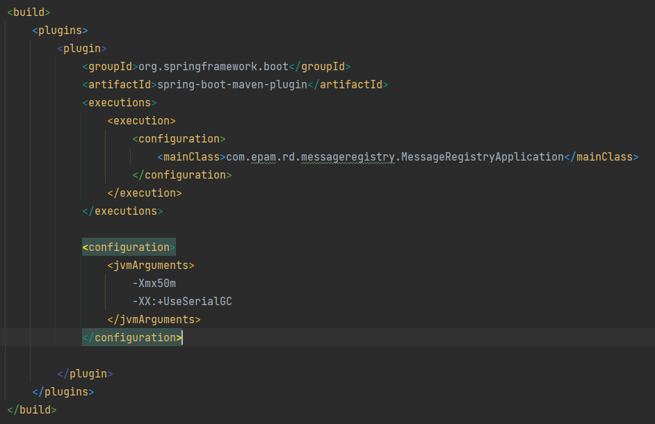
</h2>

4. run VisualVM

<h2>
   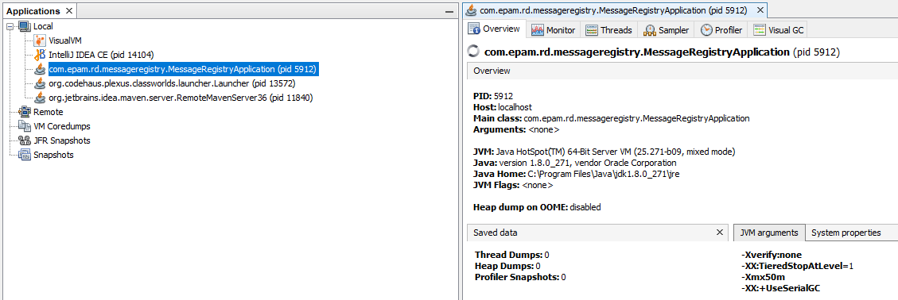
   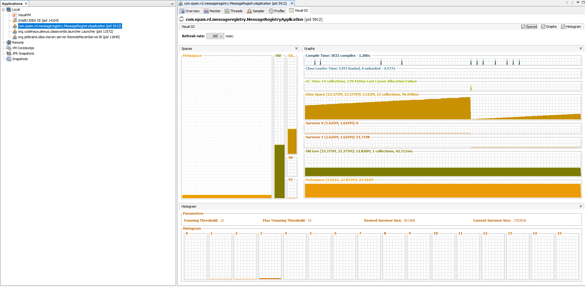
</h2>

5. Setup and run a test plan in JMeter

<h2>
   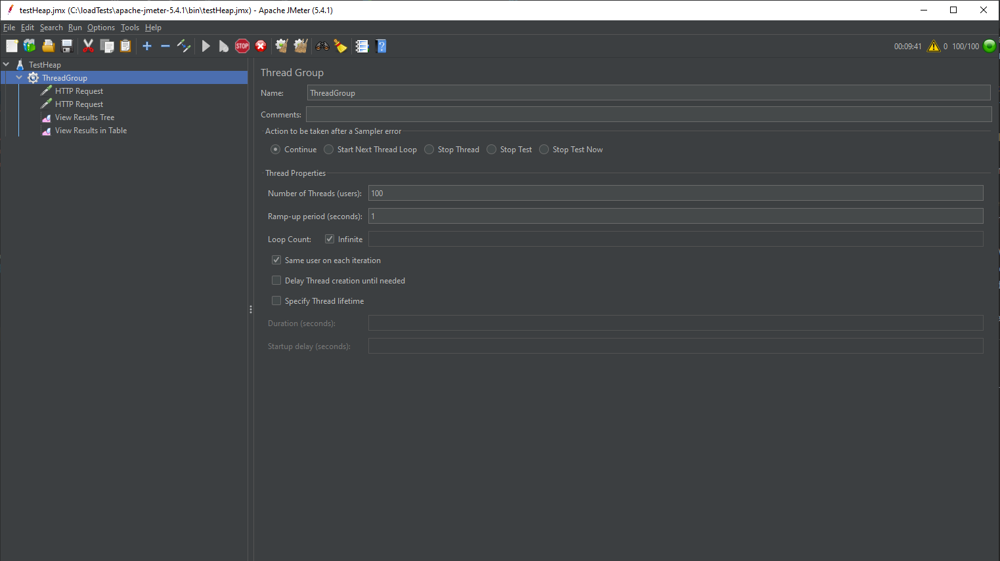
   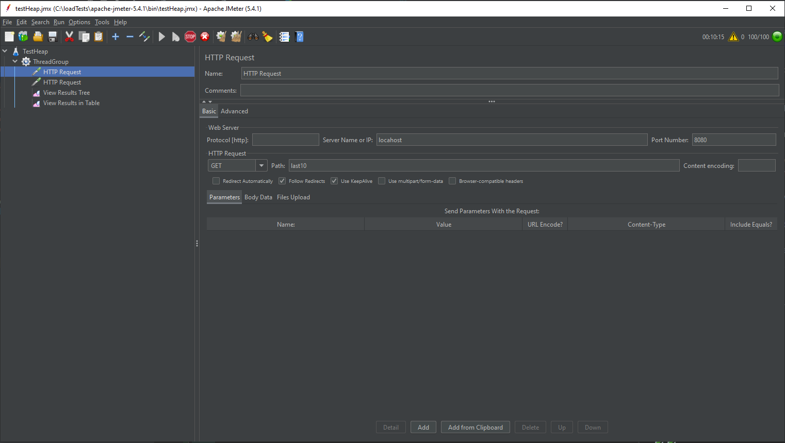
   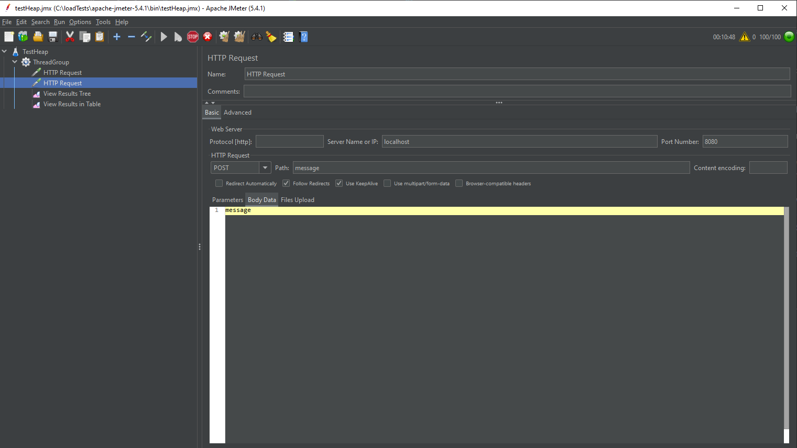
</h2>

6. Monitor heap state

   - you can also remove the HeapDump from the console  
     _jmap -dump:live,format=b,file=/tmp/nameHeapDump.bin_

<h2>
   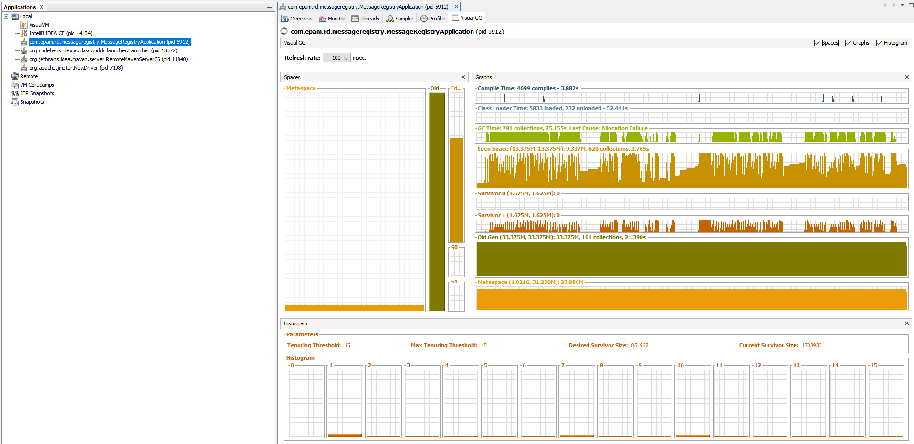
   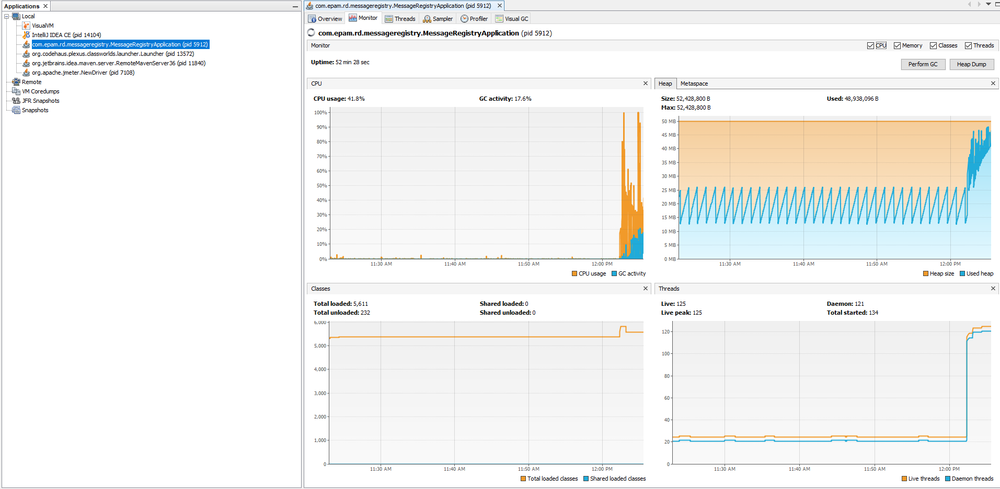
   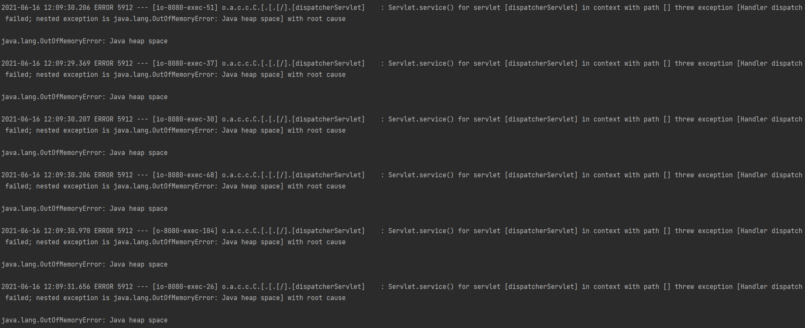
</h2>

7. Use MAT

   - The error indicates that memory is accumulating in the instance " java. lang.Object[]".
   
<h2>
   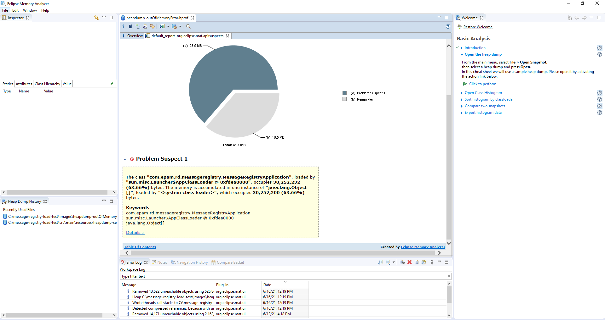
</h2>

   - Details

<h2>
   
   
   
</h2>

8. _Find the problem that caused the heap to run out of memory._

###### Problem

The problem lies in the fact that when creating requests from outside, 
   many _MessageRecord objects are created, which are later added to the 
   private static List<MessageRecord> messages = new ArrayList<>();

This list is overflowing with references to these objects that the GC cannot delete.

###### Solution

   - At a minimum, remove the static when initializing the list.
   - As a maximum, come up with another way to store information about objects.

<h2>
   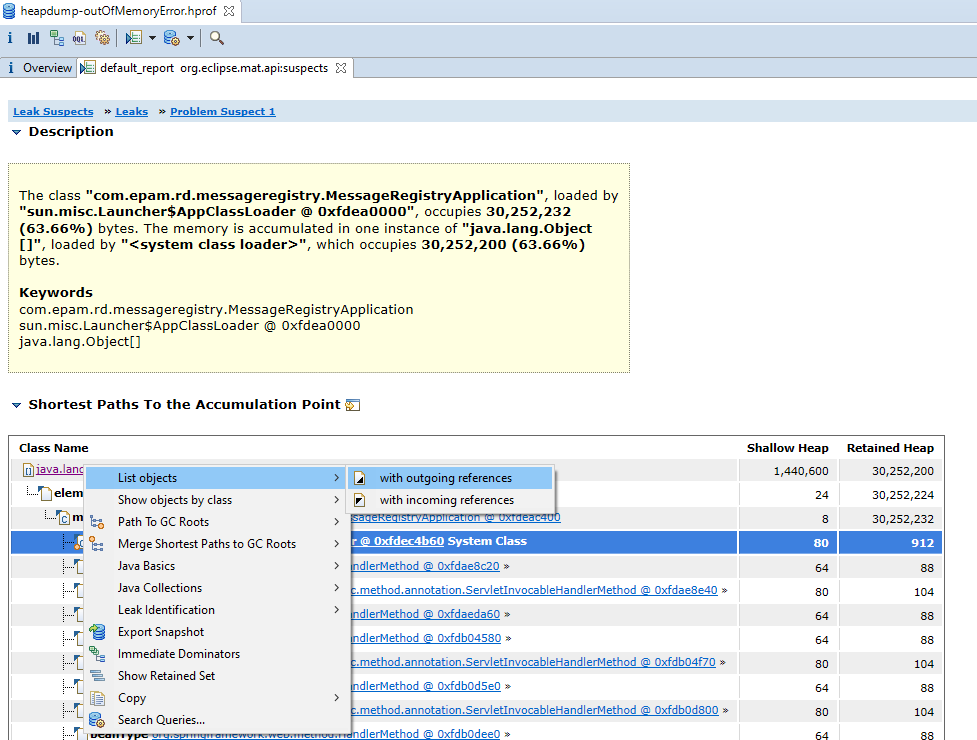
   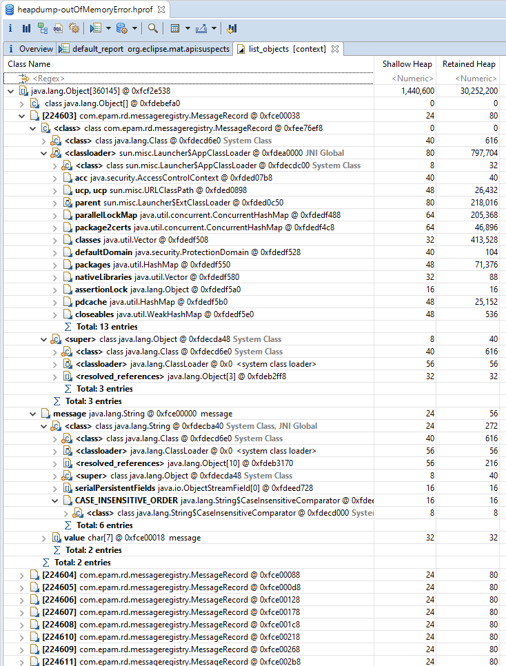
</h2>

     

