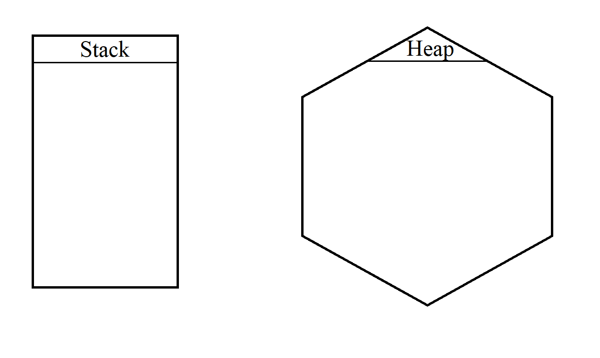
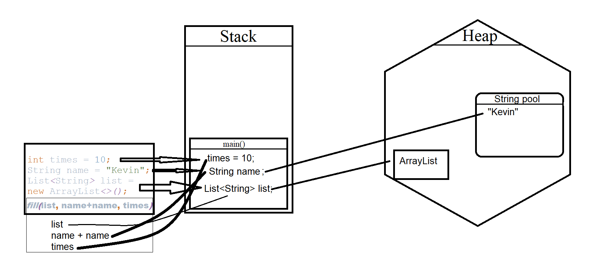
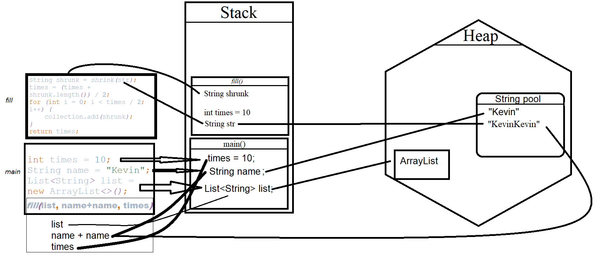
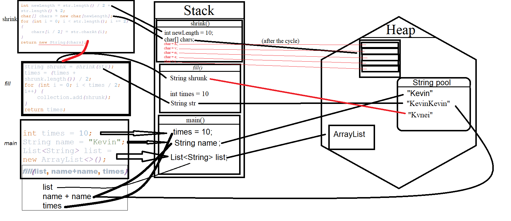

# Upskill_part_2
-------------------
> The app is compiled by Ihar Koshman

***

#### Stack-Heap Diagram

##### Task description

Follow the code below and build a step-by-step Stack-Heap Diagram.

It is OK to omit intermediate states like states within expressions evaluation, system methods calls and so on, 
    but be sure to note changes when named variable are created or user-defined methods are called.

Steps:

- Complete the step-by step Stack-Heap Diagram.
- Show the mentor your results.

***

##### Task solution

Steps:

1 To run an application in an optimal way, JVM divides memory into stack and heap memory. 

<h2>
   
</h2>

2 Before executing the main() method, 
    space will be allocated in the stack to store the primitives and references of this method:
 - the primitive _times_ value of the int type will be stored directly on the stack;
 - a _name_ reference variable of the String type will be created on the stack, 
    but the row itself will be stored in an area called the String Pool (which is part of the Heap);
 - the _list_ reference variable of the String type will also be created in the stack memory, 
    but will point to an object located on the heap;

Next, the _fill(list, name + name, times)_ method is called from the _main()_ method, 
    which passes a reference from the stack of the _main()_ method to the _ArrayList_ object, 
    two references to the _name_ object from the _String Pool_, 
    and copies the primitive type _times_

<h2>
   
</h2>

3 When calling the _fill()_ method, a new "block" of memory is allocated in the stack 
    on top of the previous one, according to the LIFO principle.

<h2>
   
</h2>

4 When the _shrink () _ method is called, 
    a new "block" of memory is allocated on top of the previous one in accordance with the LIFO principle.

<h2>
   
</h2>

   